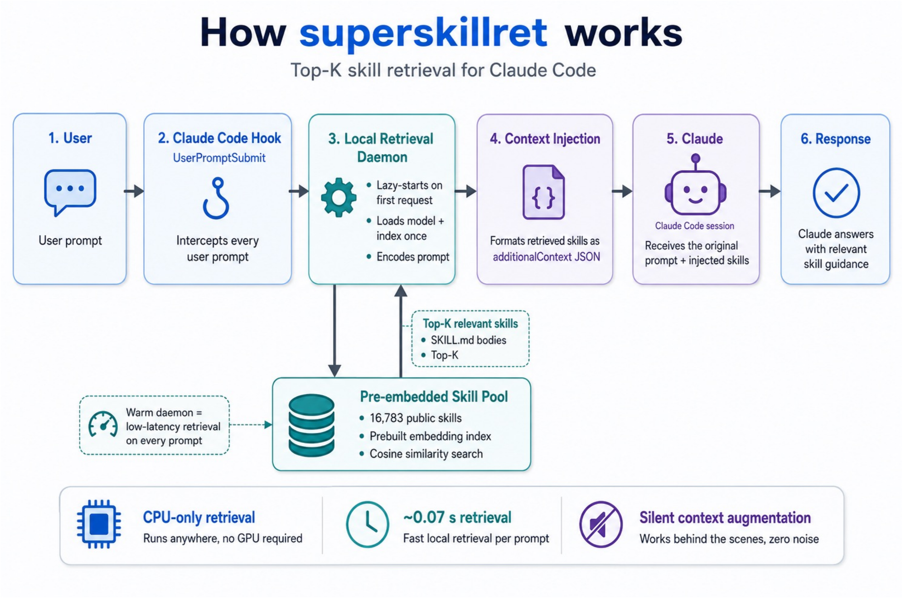

# superskillret

> Embedding-based **skill retrieval plugin for Claude Code**. On every user prompt it silently picks the top‑K most relevant skills from a pool of 16,783 public skills and injects them as context — so Claude gets the right "how to" reference without you preloading every skill in the system prompt.

Built on [`ThakiCloud/SkillRet-Embedding-0.6B`](https://huggingface.co/ThakiCloud/SkillRet-Embedding-0.6B) (fine‑tuned from Qwen3‑Embedding‑0.6B) over the [`ThakiCloud/SKILLRET`](https://huggingface.co/datasets/ThakiCloud/SKILLRET) 16,783‑skill corpus. Ships with an INT8‑quantized ONNX encoder ([`youngryankim/superskillret-onnx-int8`](https://huggingface.co/youngryankim/superskillret-onnx-int8), 598 MB) plus a prebuilt, INT8‑quantized embedding index ([`youngryankim/superskillret-index`](https://huggingface.co/datasets/youngryankim/superskillret-index)). Warm retrieval is ~0.3 s end‑to‑end on CPU.

## Quickstart

In a Claude Code session:

```
/plugin marketplace add ThakiCloud/SUPERSKILLRET
/plugin install superskillret@thakicloud
/reload-plugins
/superskillret:setup
```

`/superskillret:setup` (v0.3.1) is the synchronous fast path — it runs `scripts/install.sh` inline, spawns the daemon, and verifies retrieval end-to-end with live progress (~1–2 minutes on first run, idempotent on re-run). You can skip it and rely on the background `SessionStart` bootstrap instead: the same `scripts/install.sh` then forks in the background, creates a local venv, downloads the ONNX INT8 encoder and the prebuilt skill index from Hugging Face, and writes a `.installed` marker when it finishes.

If you take the background path, your first user prompts get a short English notice asking you to wait. Either way, once `.installed` lands, skill retrieval activates automatically on every subsequent prompt.

Follow progress with `tail -f /tmp/superskillret-install.log`. Inspect or reset the daemon at any time with `/superskillret:status` and `/superskillret:stop`.

## How it works



Every user prompt flows through the same pipeline:

1. **User** sends a prompt.
2. The **`UserPromptSubmit` hook** (`scripts/retrieve.py`) intercepts it before Claude sees it.
3. The hook talks to the **local retrieval daemon** over a Unix socket. The daemon lazy‑starts on the first request and then stays warm — model and index are loaded **once**.
4. The daemon encodes the prompt (ONNX INT8, ~0.1 s on CPU) and runs cosine similarity against the **pre‑embedded skill pool** (16,783 public skills, prebuilt index).
5. The hook formats the top‑K `SKILL.md` bodies as an `additionalContext` JSON and emits it back to Claude Code.
6. **Claude** gets the original prompt plus the injected skills and answers with that extra reference material.

Two details not shown in the diagram but live in the code:

- **First‑time setup is automatic.** A `SessionStart` hook (`scripts/bootstrap.sh`) forks `scripts/install.sh` in the background on first load to create the venv and download the encoder + index from Hugging Face, writing a `.installed` marker when done. While setup runs, the hook shows a polite English wait‑notice instead of retrieval.
- **Per‑session dedup.** The daemon tracks, per `session_id`, which skills it already returned and skips them in future retrievals for that session, so the same `SKILL.md` isn't re‑injected into every turn. Clear with `/superskillret:reset`.

## Configuration

### Retrieval hyperparameters

These two knobs control the **quality vs. token‑cost** tradeoff. Every prompt injects up to `TOP_K` full `SKILL.md` bodies (~2–5 KB each) into Claude's context.

| Variable | Default | Meaning |
|---|---|---|
| `SUPERSKILLRET_TOP_K` | **`3`** | How many skills to inject per prompt. Higher = more context, more input tokens. |
| `SUPERSKILLRET_MIN_SCORE` | **`0.30`** | Drop hits below this cosine score. Higher = stricter, fewer (sometimes zero) hits. |

Token‑cost calibration (empirical, ~42 KB average additional context at `TOP_K=5 / MIN_SCORE=0.25`):

| Setting | Extra input tokens / prompt | Relative cost |
|---|---|---|
| `TOP_K=5`, `MIN_SCORE=0.25` | ~10,000 (median) | baseline |
| **`TOP_K=3`, `MIN_SCORE=0.30`** (default) | **~5,000–7,000** | **~40–50 % off** — recall‑leaning |
| `TOP_K=3`, `MIN_SCORE=0.40` | ~3,000–6,000 | ~60 % off — stricter |
| `TOP_K=1`, `MIN_SCORE=0.40` | ~1,500–2,500 | ~80 % off |
| `TOP_K=3`, `MIN_SCORE=0.55` | 0–3,000 (often 0) | aggressive; most off‑topic prompts inject nothing |

Bump `MIN_SCORE` if you want fewer, more relevant hits; lower it if you want more recall.

### Runtime settings

| Variable | Default | Meaning |
|---|---|---|
| `SUPERSKILLRET_DISABLE` | unset | set to `1` to turn the hook into a no‑op (retrieval is silently skipped) |
| `SUPERSKILLRET_SPAWN_WAIT` | `180` | seconds the hook waits for a lazy‑spawned daemon to come up. Raise on slow networks / first‑time installs. |
| `SUPERSKILLRET_SEEN_TRACKING` | **`0`** (since v0.2.5) | per‑session dedup. Off by default: a skill's active framing (MUST/SHOULD directives) only stays "current authoritative reference material" while the skill is re-injected each turn, so dedup left the body in history but expired its active intent. Set to `1` if you'd rather save the ~5-7K tokens per repeated retrieve and accept that the same query may produce different behaviour across turns. |
| `SUPERSKILLRET_ONNX_REPO` | `youngryankim/superskillret-onnx-int8` | HF repo the encoder is fetched from. Override to use your own fine‑tuned encoder. |
| `SUPERSKILLRET_INDEX_REPO` | `youngryankim/superskillret-index` | HF repo the prebuilt index is fetched from. Override if you publish your own skill corpus. |

Variables can be set in the shell, in `~/.claude/settings.json` under `"env": {...}`, or in the hook `command` itself. A handful of lower‑level knobs (socket/pid/log paths, ONNX dir override, session‑dedup internals, `BACKEND=pytorch` fallback) live in the daemon docstring if you need them.

### Forcing a re‑install / re‑fetch

| Command | Effect |
|---|---|
| `FORCE=1 bash scripts/install.sh` | wipe `.venv/` and re‑run every step from scratch |
| `SUPERSKILLRET_SKIP_PREBUILT=1 bash scripts/install.sh` | build the embedding index locally instead of fetching it from HF (useful when customizing the skill pool) |

### CPU‑only

superskillret runs on CPU by design. A single ONNX INT8 forward pass per prompt is ~0.1 s, which fits inside Claude's own answer latency — there is no GPU path to configure.

## Latency

End‑to‑end, hook invocation to `additionalContext` emitted.

| Call | Latency | Notes |
|---|---|---|
| First prompt in a session (daemon cold; loads ONNX encoder + index) | ~15–30 s | one‑time per session |
| Warm prompt | **~0.3 s** | ~0.1 s hook Python startup + ~0.2 s daemon work |

Retrieval quality vs. the un‑quantized FP32 reference: top‑1 skill identical across the smoke‑test queries; top‑5 overlap ~80 % (same topic, minor reshuffles between near‑duplicate skills in the corpus).

## Usage

You don't interact with superskillret directly — it just runs on every user prompt via the `UserPromptSubmit` hook.

| Slash command | What it does |
|---|---|
| `/superskillret:status` | daemon pid, socket state, last 20 log lines |
| `/superskillret:stop` | kill the daemon; it lazy‑starts again on the next prompt |
| `/superskillret:reset` | clear the per‑session "already seen" skill memory so the next prompt can surface any skill again |
| `/superskillret:add <path>` | validate a SKILL.md and add it to the index (v0.2.0). Stored in a writable user pool that survives system index upgrades. See [Adding custom skills](#adding-custom-skills) below. |
| `/superskillret:list` | list all user‑added skills (the 16,783 system skills are not shown — too many) |
| `/superskillret:remove <name>` | remove a user‑added skill by name. Does not touch system skills |

## Adding custom skills

Since v0.2.0 you can register your own SKILL.md files into the retrieval index without rebuilding the entire embedding cache.

### Skill file format

A SKILL.md needs YAML frontmatter with `name` and `description`, then a body. Example (`~/skills/my-auth.md`):

```markdown
---
name: my-auth
description: Use when the user needs to implement email/social login with JWT tokens. Covers signup, signin, refresh flow, and RBAC.
---

# my-auth

You MUST follow the JWT-based session flow described below when the user asks
about login, signup, or authentication.

1. Issue access token (15 min) + refresh token (7 days).
2. ...
```

### Register it

You can pass a file path, a directory of `.md` files, a bare skill name, or nothing at all:

```
# explicit file
/superskillret:add ~/skills/my-auth.md

# directory — batch-adds every *.md and */SKILL.md inside
/superskillret:add ~/skills/

# bare name — looked up under ~/.superskillret/skills/{name}/SKILL.md
# or ~/.superskillret/skills/{name}.md
/superskillret:add my-auth

# no argument — scans the default user-skills directory
# (~/.superskillret/skills/, override with SUPERSKILLRET_USER_SKILLS_DIR)
/superskillret:add

# stdin
cat my-auth.md | /superskillret:add -
```

**Convention**: drop your SKILL.md files in `~/.superskillret/skills/` (one per file, or one per `<name>/SKILL.md` sub-directory). After that, `/superskillret:add` with no argument picks them all up.

**Duplicate handling**: re-running on a file whose `name` is already in the user pool prints `○ Skipped 'foo' — already in user pool` and does **not** count as a failure. The batch summary distinguishes added vs. skipped vs. failed. To replace an existing entry, pass `--force` (e.g. `/superskillret:add ~/skills/my-auth.md --force`).

Output on success:
```
✓ Added 'my-auth' to superskillret
    user-pool row: 0
    global row:    16783
    encode time:   75 ms
    nearest existing: auth-skill (0.43) — distinct
    self-retrieval:   0.94
```

### Validation rules

The validator blocks the add if any of these fail:

| Rule | Limit |
|---|---|
| File must be valid UTF‑8 | ≤ 1 MB |
| Frontmatter delimiters | `---` open and close |
| Required fields | `name`, `description` |
| `name` shape | `^[a-z0-9][a-z0-9-]{1,63}$` (kebab‑case, 2–64 chars) |
| `description` length | 20 – 500 chars |
| `body` length | ≥ 100 chars (warning if > 50 KB) |
| Security | no known prompt‑injection patterns (e.g. "ignore previous instructions", `<system>` tags) |
| Name uniqueness | rejected if already in the corpus; `--force` to overwrite a user‑pool entry |

Quality checks are reported but **do not block** (they're advisory):

- **Self‑retrieval score**: encode the description as a query and measure its cosine with the new skill vector. Healthy descriptions land around 0.7–0.9; below 0.6 suggests the description is too generic.
- **Nearest existing**: cosine to the closest already-indexed skill. Above 0.85 means you have a near‑duplicate of an existing skill — consider editing that one instead.

### User pool vs system index

User‑added skills are stored separately:

```
cache/
├── skill_embeddings.npy          ← system (16,783 skills, refreshed by install.sh)
├── skill_metadata.jsonl          ← system
├── user_skill_embeddings.npy     ← user pool (writable, survives upgrades)
└── user_skill_metadata.jsonl     ← user pool
```

The daemon concatenates both at load time and treats them uniformly for retrieval. Upgrading the system index (re-running `install.sh`, or downloading a new version of `youngryankim/superskillret-index`) leaves your user pool untouched.

### Hot reload — no restart needed

`add` and `remove` mutate the in‑memory index inside the running daemon and persist atomically. Retrieval picks up the change on the very next prompt; no `/superskillret:stop` required.

## Files

```
superskillret/
├── .claude-plugin/
│   ├── plugin.json                # plugin manifest
│   └── marketplace.json           # self‑hosted marketplace entry (HTTPS URL source)
├── hooks/hooks.json               # registers SessionStart (bootstrap) + UserPromptSubmit (retrieve)
├── commands/
│   ├── status.md                  # /superskillret:status
│   ├── stop.md                    # /superskillret:stop
│   ├── reset.md                   # /superskillret:reset (clear per-session dedup memory)
│   ├── add.md                     # /superskillret:add <path>  (v0.2.0)
│   ├── list.md                    # /superskillret:list        (v0.2.0)
│   └── remove.md                  # /superskillret:remove <name> (v0.2.0)
├── scripts/
│   ├── bootstrap.sh               # SessionStart: fork install.sh in background, exit in ms
│   ├── install.sh                 # one‑shot setup (venv, ONNX encoder, embedding index)
│   ├── daemon.py                  # long‑running retrieval server (Unix socket)
│   ├── retrieve.py                # UserPromptSubmit hook: thin socket client + wait‑notice
│   ├── build_index.py             # (re)build the embedding index from a skill pool
│   ├── quantize_onnx.py           # INT8‑quantize a fresh ONNX export
│   ├── publish_index.py           # upload cache/ to HF dataset repo (maintainer only)
│   ├── compare_backends.py        # PyTorch vs ONNX FP32 vs INT8 parity benchmark (dev)
│   ├── smoke_test.py              # small retrieval sanity test (dev)
│   ├── skill_validator.py         # SKILL.md validation (used by /superskillret:add, v0.2.0)
│   ├── skill_io.py                # atomic append/remove on the user pool (v0.2.0)
│   └── add_skill_cli.py           # CLI entry called by /superskillret:add (v0.2.0)
├── tests/
│   ├── fixtures/*.md              # SKILL.md samples covering valid and invalid cases
│   ├── test_validator.py          # unit tests for skill_validator
│   └── test_skill_io.py           # smoke tests for atomic append / remove
├── figure/
│   ├── superskillret.pdf          # flow diagram source
│   └── superskillret.png          # rendered for README inline display (300 dpi)
├── onnx_model_int8/               # (downloaded) model.onnx + tokenizer files
├── cache/                         # (downloaded) skill_embeddings(_int8|_scale).npy + metadata.jsonl
├── skill_pool/skills.jsonl        # (optional) full skill corpus, only needed for local index rebuild
└── .installed                     # marker written by install.sh on success; drives wait‑notice logic
```

## Retrieval pipeline internals

1. Each skill's `(name | description)` is encoded at build time with the SKILLRET model; embeddings are L2‑normalized.
2. The embedding index is stored as `skill_embeddings_int8.npy` + per‑vector `skill_embeddings_scale.npy` (75 % smaller than float32 with negligible quality loss); the daemon falls back to `skill_embeddings.npy` if only the float32 copy is present.
3. At query time the daemon encodes `"Instruct: Given a skill search query, retrieve relevant skills that match the query\nQuery: <user prompt>"` (the query‑side prompt SKILLRET was trained with) and ranks skills by inner product.
4. Hits below `MIN_SCORE` are dropped so off‑topic prompts (small talk, meta questions) emit an empty `additionalContext` and cost zero extra tokens.
5. **Per‑session dedup (opt-in, off by default in v0.2.5+)**: when `SUPERSKILLRET_SEEN_TRACKING=1`, the daemon remembers — per `session_id` — which row indices it already returned, and skips them next time. This caps the same `SKILL.md` from being re-injected every turn and surfaces alternative skills, at the cost of inconsistent activation: a skill's `MUST/SHOULD` directives only stay authoritative while its body is being re-injected, so dedup expired its active framing while keeping the body lingering in conversation history. v0.2.5 flipped the default to off. The LRU cap is `SUPERSKILLRET_MAX_SESSIONS`; state resets per daemon restart and is clearable via `/superskillret:reset`.

6. **Retrieved vs used (v0.2.5+)**: every emitted `additionalContext` asks Claude to print two notices — `_superskillret retrieved: …_` at the top (the names that came back from the daemon) and `_superskillret used: …_` at the bottom (the names whose bodies actually shaped this turn, or `none`). The "retrieved" line is deterministic and produced by the daemon; the "used" line is Claude's self-report. Comparing the two over a session is how you tell whether a particular skill is doing real work or just sitting in context.

Model card eval (FP32): NDCG@15 = 0.7887, Recall@10 = 0.8542. The INT8 pipeline shipped here hasn't been re‑benchmarked against the official SKILLRET eval splits — see Roadmap.

## Troubleshooting

- **First prompt just shows a "setup is running" notice.** Expected. `install.sh` is still downloading in the background. `tail -f /tmp/superskillret-install.log` to watch progress; retry the prompt in a minute.
- **Hook times out.** `install.sh` is still going but exceeded `SUPERSKILLRET_SPAWN_WAIT` (default 180 s) from the hook's point of view. Usually harmless — the install continues; try another prompt. To raise the window: export `SUPERSKILLRET_SPAWN_WAIT=300`.
- **No skills ever get injected.** Run `/superskillret:status`. If the socket is missing and ping fails, try `bash scripts/install.sh` directly in a terminal to see the full error. Common causes: HF repo unreachable, pip install failed.
- **Retrieved skills feel off.** Raise `SUPERSKILLRET_MIN_SCORE` to `0.40`–`0.45` so only strongly matching hits survive, and/or drop `SUPERSKILLRET_TOP_K` to 1–2.
- **Context window fills up too fast.** Each hit is ~2–5 KB of `SKILL.md`; lower `TOP_K` and raise `MIN_SCORE`. See the token‑cost table above.
- **Want to add a single custom skill.** Use `/superskillret:add <path-to-SKILL.md>` (v0.2.0). It validates the file, encodes it with the same ONNX INT8 encoder the daemon uses, and appends to a writable user pool. No daemon restart and no full index rebuild required. See [Adding custom skills](#adding-custom-skills).
- **Want to replace the entire skill corpus.** Replace `skill_pool/skills.jsonl` (one JSON record per line with `name`, `description`, `body`), run `python scripts/build_index.py`, then restart the daemon via `/superskillret:stop`. This rebuilds the system index from scratch (~30–60 min on CPU); the user pool is preserved.

## Status & roadmap

Production‑ready and installed via the `thakicloud` marketplace. End‑to‑end verified in a live Claude Code session. Default backend is ONNX INT8, default embedding index is INT8‑quantized, default install path (HF prebuilt fetch) takes ~45 s on a healthy connection.

### What's shipped

- **Custom skill registration (v0.2.0)** — `/superskillret:add` accepts a SKILL.md path, validates frontmatter + body + security, runs quality checks (self-retrieval score, near-duplicate detection), then encodes via the ONNX INT8 path and appends to a writable user pool. Hot-reloaded into the in-memory index so the next prompt picks it up. Companion commands: `/superskillret:list`, `/superskillret:remove`. User pool is stored in `cache/user_skill_*` and survives system index upgrades.
- **ONNX INT8 encoder** (598 MB, ~0.1 s CPU inference) replaces the 2.4 GB PyTorch path. ~18× faster than the original 5.5 s warm latency. Published at [`youngryankim/superskillret-onnx-int8`](https://huggingface.co/youngryankim/superskillret-onnx-int8).
- **INT8‑quantized embedding index** (17 MB + 67 KB scale vs. 34 MB FP32), auto‑selected by the daemon when present. Reconstruction error mean 2e‑4 / max 8e‑4.
- **Prebuilt index** at [`youngryankim/superskillret-index`](https://huggingface.co/datasets/youngryankim/superskillret-index) (public). `install.sh` downloads in ~5 s, falls back to a local rebuild (30–60 min on CPU) only if HF is unreachable.
- **Self‑hosted marketplace** in the same repo (`.claude-plugin/marketplace.json`, HTTPS source so SSH‑keyless installs work).
- **Auto‑bootstrap**: `SessionStart` hook forks `install.sh` in the background; `retrieve.py` shows a polite English wait‑notice until the `.installed` marker appears. No manual `bash scripts/install.sh` required for regular users.

### Known limitations

- **No idle timeout on the daemon.** It stays resident (~1.4 GB RAM) until `/superskillret:stop` or a kill.
- **Quality is spot‑checked, not formally benchmarked.** Parity vs. the FP32 PyTorch reference is top‑1 100 % / top‑5 80 % on a 10‑query smoke test. NDCG@15 / Recall@10 against the official SKILLRET eval splits has not been re‑run for the INT8 pipeline.
- **Token cost is real.** At defaults each on‑topic prompt costs ~5–7 K extra input tokens. See Configuration for the cost table.

### Roadmap — pick‑one, pick‑none

1. **Daemon idle timeout** — add `last_request_at` tracking in `scripts/daemon.py` plus a watchdog thread that `SIGTERM`s itself after N idle seconds (`SUPERSKILLRET_IDLE_TIMEOUT`, e.g. 1800 s). The socket client already lazy‑spawns, so reaping the daemon is free — the only cost is one cold‑start after idle.
2. **Regression eval against the SKILLRET benchmark** — load `queries` + `qrels` test splits, compute NDCG@15 and Recall@10 for PyTorch / ONNX FP32 / ONNX INT8. Commit as `scripts/eval.py` and run it as a gate before any encoder or index swap.
3. **Submit to the official Anthropic marketplace** — https://platform.claude.com/plugins/submit. Gets the plugin listed under `claude-plugins-official` in the `/plugin` Discover tab. Anthropic‑curated, takes days‑to‑weeks.

### Maintainer‑only — refreshing the prebuilt artefacts

Bump the index:

```bash
# bump cache/VERSION first, then:
python scripts/build_index.py
HF_TOKEN=... python scripts/publish_index.py --repo youngryankim/superskillret-index
```

Refresh the ONNX encoder:

```bash
optimum-cli export onnx --model ThakiCloud/SkillRet-Embedding-0.6B ./onnx_model
python scripts/quantize_onnx.py --src onnx_model --dst onnx_model_int8
# then upload onnx_model_int8/ to youngryankim/superskillret-onnx-int8 via the HF web UI or hf upload
```

## License

MIT.
